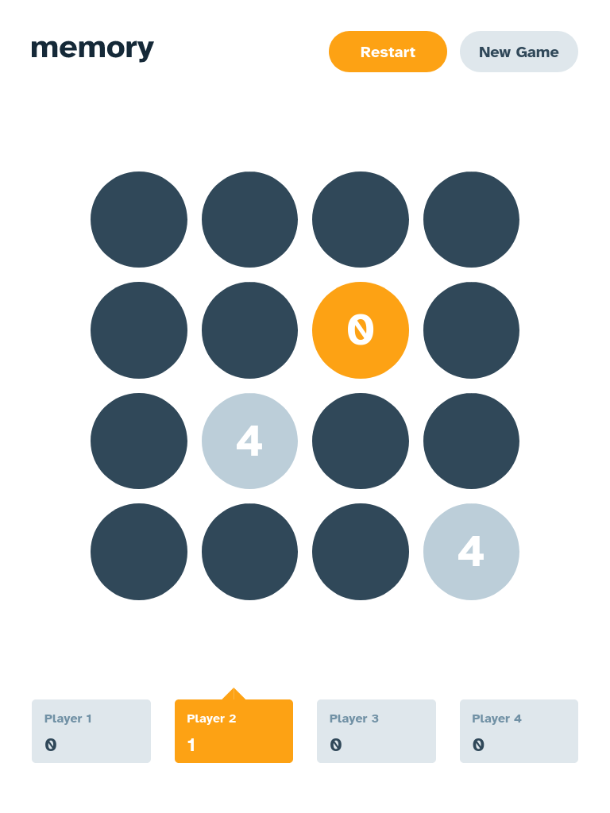

# Frontend Mentor - Memory game solution

This is a solution to
the [Memory game challenge on Frontend Mentor](https://www.frontendmentor.io/challenges/memory-game-vse4WFPvM). Frontend
Mentor challenges help you improve your coding skills by building realistic projects.

## Table of contents

- [Overview](#overview)
    - [The challenge](#the-challenge)
    - [Screenshot](#screenshot)
    - [Links](#links)
- [My process](#my-process)
    - [Built with](#built-with)
    - [What I learned](#what-i-learned)
    - [Continued development](#continued-development)
    - [Useful resources](#useful-resources)
- [Author](#author)

## Overview

### The challenge

Users should be able to:

- View the optimal layout for the game depending on their device's screen size
- See hover states for all interactive elements on the page
- Play the Memory game either solo or multiplayer (up to 4 players)
- Set the theme to use numbers or icons within the tiles
- Choose to play on either a 6x6 or 4x4 grid

### Screenshot

### Links

- Solution URL: [GitHub Repository](https://github.com/smccourtb/memory-game)
- Live Site URL: [Live Demo](https://smccourtb.github.io/memory-game/)

## My process

### Built with

- Semantic HTML5 markup
- Flexbox
- CSS Grid
- Mobile-first workflow
- [React](https://reactjs.org/) - JS library
- [Styled Components](https://styled-components.com/) - For styles

### What I learned

I learned quite a bit with this project. This is my 3rd project using React but my 1st with styled components. I like
how closely the two are related and how they share the component/prop aspect. I learned how to pass props into
components, so I can apply properties conditionally> I like this method as it reduces the amount of classes I needed to
create. The "css" is much more succinct and easier to follow. Huge fan.

### Continued development

I couldn't get a clear answer on this searching around, but I feel my implementation of props is messy and could be
simplified. I'd like thoroughly plan through my next project and avoid the pitfalls I ran into this project, such as
dealing with setInterval, setTimeout, and how and where to manage state more efficiently. TESTS TESTS TESTS. My next
focus will be testing. I plan to go back through my projects and incorporate tests using Jest.

### Useful resources

- [React Docs](https://reactjs.org/docs/getting-started.html) - These docs were my bible throughout this project. Great
  resource from the devs themselves.
- [Styled Components](https://styled-components.com/) - This site was a huge help for me. Everything was explained
  clearly with great examples.

## Author

- Frontend Mentor - [@smccourtb](https://www.frontendmentor.io/profile/smccourtb)
